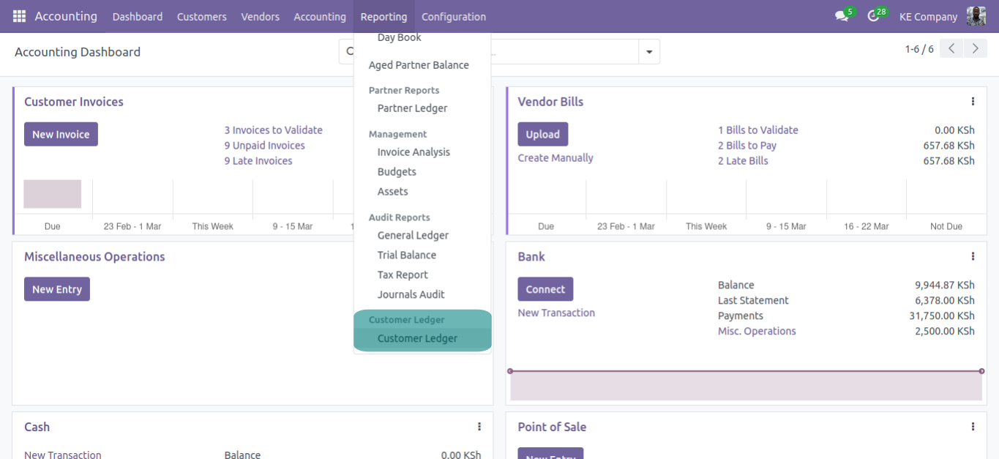
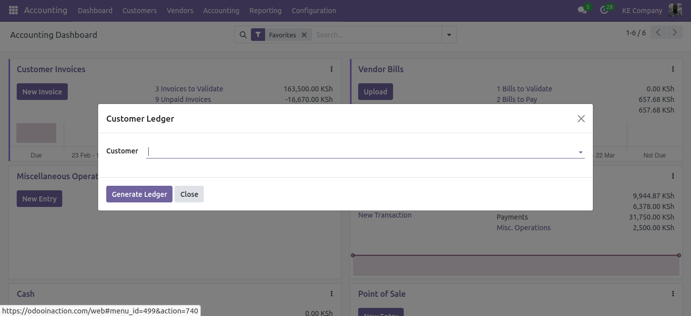
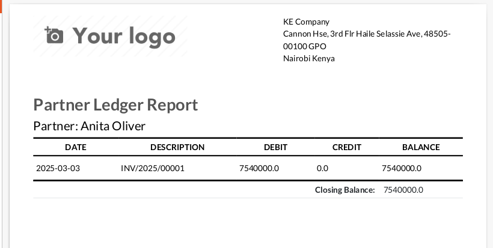

## Customer / Vendor (Partner) Ledger Report

This module enables you to generate customers' and vendors' ledger reports in Odoo. It depends on Invoicing (account)

When installed, it introduces a new menu item __Customer Ledger__ in __Invoicing(Account)__ > __Reporting__.

This Menu Item opens a wizard, where you select the partner whose report you want to generate.

A sample of the generated report. The report takes the configured document layout.

